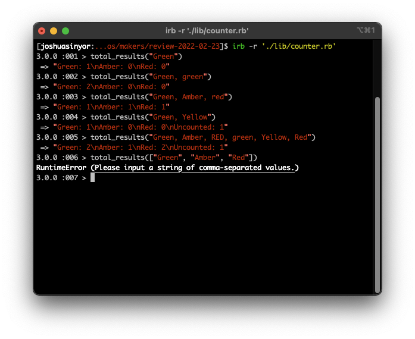

# Ruby Template

A template repository for Ruby projects.

---

- [Installation](#installation)
- [Specification](#specification)
  * [Input/Output Table](#input-output-table)
- [Acceptance Criteria](#acceptance-criteria)
  * [Input/Output Table](#input-output-table)
- [Final Appearance](#final-appearance)
- [Dependencies](#dependencies)
- [Author(s)](#author-s-)
- [License(s)](#license-s-)
- [Acknowledgements](#acknowledgements)

---

## Installation

This project requires Ruby 3.0.0. If you do not have Ruby 3.0.0, install it using [these instructions](https://www.ruby-lang.org/en/documentation/installation/).

1. [Clone](https://docs.github.com/en/github/creating-cloning-and-archiving-repositories/cloning-a-repository) or [fork](https://docs.github.com/en/github/getting-started-with-github/fork-a-repo) this repository.
2. Install the necessary Gems from the `Gemfile` by executing `bundle install`.

---

## Specification

1. The purpose of this program is process school test results.
2. This program receives input of results as a string of comma-separated values. These values could be in any combination of upper- and lower-case.
3. This program should parse this string, and sum the total of each instance of the colours `green`, `amber` and `red`.
4. The program should return the totals in the format `Colour: #`, with each of the three colours returned on a new line.
5. Even if no instances of the three colours are found, the sum of that colour should be returned.
5. This program should sum the total of any instance of any other input as `Uncounted`.
6. If no `Uncounted` instances are found, the program should not return `Uncounted` as a category.

### Input/Output Table

| Input | Output |
|-------|--------|
| "Green" | `Green: 1` |
| "Green, green" | `Green: 2` |
| "Green, AMBER, Red" | `Green: 1\nAmber: 1\nRed: 1\n` |
| "Green, Yellow" | `Green: 1\nUncounted: 1` |

---

## Acceptance Criteria

This program must:

1. [ ] Parse the input of a  of the colours green, amber or red.
2. [ ] Parse the input of a CSV string of at least two of green, amber and red.
3. [ ] Parse the input of a CSV string of colours which are not green, amber or red.
4. [ ] Raise error `Please input a string of comma-separated values.` upon the input of anything other than a `String` object.

### Input/Output Table

| Input | Output |
|-------|--------|
| "Green" | `Green: 1` |
| "Green, green" | `Green: 2` |
| "Green, Amber, red" | `Green: 1\nAmber: 1\nRed: 1\n` |
| "Green, Yellow" | `Green: 1\nUncounted: 1` |
| "Green, Amber, RED, green, Yellow, Red" | `Green: 2\nAmber: 1\nRed: 2\nUncounted: 1` |
| ["Green", "Amber", "Red"] | Error `Please input a string of comma-separated values.` |

---

## Final Appearance

To take a screenshot of the window in Windows, use shortcut `⊞ + Shift + S`. To take a screenshot of the window on OSX, use shortcut `Shift + ⌘ + 5`.

This program is pictured below executing the instructions in the Acceptance Criteria.

---

## Dependencies

This program's dependencies are minimal and relate solely to testing. All dependencies are explicitly invoked in the `Gemfile`.

- [Ruby](https://www.ruby-lang.org/), courtesy of [Yukihiro Matsumoto](https://github.com/matz).
- [RSpec](https://rspec.info/), courtesy of [Jon Rowe](https://github.com/JonRowe), [Benoit Tigeot](https://github.com/benoittgt), [Phil Pirozhkov](https://github.com/pirj), [Xavier Shay](https://github.com/xaviershay) and [Yuji Nakayama](https://github.com/yujinakayama).
- [Rubocop](https://rubocop.org/) and [Rubocop-RSpec](https://github.com/rubocop/rubocop-rspec), both courtesy of [Bozhidar Batsov](https://github.com/bbatsov).
- [SimpleCov](https://github.com/simplecov-ruby/simplecov), courtesy of [Christoph Olszowka](https://github.com/colszowka).
- [SimpleCov-Console](https://github.com/chetan/simplecov-console), courtesy of [Chetan Sarva](https://github.com/chetan).

---

## Author(s)

Authored by [Joshua Sinyor](https://gist.github.com/JoshSinyor).

---

## License(s)

This project is licensed under the [MIT License](LICENSE).

---

## Acknowledgements

* Table of contents generated with [markdown-toc](https://ecotrust-canada.github.io/markdown-toc/).
* Markdown tables generated with [TablesGenerator](https://www.tablesgenerator.com/markdown_tables).
